# Build Roadmap — Pacific Insurance PH Operations Platform

> **Our internal execution plan, not a client source document.** The files under
> `docs/foundation/`, `docs/data-model/`, `docs/frameworks/`, `docs/modules/`, and
> `docs/workflows/` describe *what the client wants*. This document is *our team's decision* on
> **what we build, in what order, over the next 3 months** — including a few deliberate deviations
> from the spec (noted inline). Last updated: **2026-06** (start of the build).

## Goal

Turn the current mock — 13 fully-designed screens running on hardcoded data — into a **real,
usable internal operations system** that gets Matt (owner) and Eman (ops) off spreadsheets,
backed by Supabase and driven by the spec's workflows, with **email + WhatsApp/SMS outbound
automation**.

**Constraints & decisions:**

| Decision | Choice |
|---|---|
| Builder | Solo + Claude Code → focused scope, vertical-slice delivery |
| Target | *Prioritized core* (real staff-side ops), not full V1 |
| Messaging | First-class V1 module: Resend (email) **+** Evolution API (WhatsApp/SMS) |
| Deferred | Client Hub portal; Medical / Senior / Amendment / Reinstatement workflows |
| Timeline | ~12 weeks (3 months) |

## Where we are today

| Area | State |
|---|---|
| UI / brand | ✅ Done — emerald theme, light + dark, 13 screens, Kanban prospects, sortable tables |
| App shell | ✅ Client-side SPA router in `components/hub/` (state-based, single route `/`) |
| Data layer | 🟡 Repository pattern proven for **Clients only** (`lib/repositories/clients/`) |
| DB schema | ❌ Not created — only a placeholder `clients` table; **no migrations** |
| Auth | ❌ None |
| Storage / documents | ❌ None |
| Email / messaging | ❌ None (Resend named in README, no code) |
| Workflows / automation | ❌ None |
| Dashboards | 🟡 Mock data only |

**Implication:** the front-end is ~80% mocked; the back-end is ~5% built. The 3-month job is
**backend + wiring**, not UI design.

## Deliberate deviations from the spec

1. **WhatsApp/SMS pulled forward into V1.** The
   [MVP Scope & Phase Roadmap](foundation/mvp-scope-and-phase-roadmap.md) defers Viber/SMS/WhatsApp
   to Phase 2. We are instead building outbound messaging as a **first-class V1 module** behind a
   channel-agnostic service (Resend + Evolution API adapters), because automated client
   notifications over WhatsApp deliver outsized value for this clientele.
2. **Client Hub deferred to Phase 2.** The spec lists Client Hub as a V1 module; for a solo
   3-month build we defer the public portal and focus on staff-side operations first.
3. **Low-volume workflows deferred.** Of the 8 workflows, V1 fully builds Standard New Business,
   Standard Renewal, Claims Assistance, and Travel Fulfillment. Medical Review, Senior, Amendment,
   and Reinstatement are handled as status variants or deferred.
4. **Configurability stays pragmatic.** Everything is data-driven (products, plans, workflow
   templates/steps, email/message templates) and **seeded via SQL**; no no-code builder UIs in V1.

## Architecture rails (build before feature work)

1. **Schema-first via Supabase migrations.** Stand up the Supabase CLI + `supabase/migrations/`
   (none exist yet); author the full core schema from
   [Data Model / Database Schema](data-model/data-model-database-schema.md); regenerate
   `lib/supabase/types.ts`.
2. **Repository per entity.** Copy the canonical `Clients` repo (`lib/repositories/clients/`:
   entity + interface + supabase impl + factory). No Prisma — supabase-js over the service role.
3. **Server Actions for all mutations**; screens stay client components calling actions. Service
   role stays server-only (`lib/supabase/admin.ts`).
4. **Cross-cutting writers, called from every action:** reference-number generator
   (`APP-2026-000123`…), immutable **audit trail**, and human-friendly **activity timeline**
   (see [the framework](frameworks/activity-timeline-and-audit-trail-framework.md)).
5. **Channel-agnostic `MessagingService`** with `ResendAdapter` (email) and `EvolutionAdapter`
   (WhatsApp/SMS); every send logs to `communications`.
6. **Auth:** Supabase Auth, email/password for 2–3 staff, role column (Owner / Ops / Admin),
   middleware route protection.

## Module catalog

### In scope (3 months)

| # | Module | Notes |
|---|---|---|
| 1 | **Auth & Users/Roles** | Supabase Auth, staff login, RBAC |
| 2 | **Clients** (+ Dependents) | Master record; detail page w/ record header + related panel + timeline; duplicate detection |
| 3 | **Documents & Storage** | Supabase Storage, versions, visibility levels, download logging, document library |
| 4 | **Products / Plans** | Product → version → plan → add-on → discount → premium tables; seeded |
| 5 | **Applications** | New Business *Standard*; hosts the **Workflow Engine** (template→instance→steps, statuses, due dates) |
| 6 | **Policies** | Issuance, internal POL# + Pacific Cross#, product-version snapshot rule |
| 7 | **Renewals** | *Standard* renewal; auto-schedule + reminders (45/30/14/7d); stop on payment |
| 8 | **Travel Insurance** | Fast workflow, payment-request PDF + QR, acknowledgement, portal-purchase tracking, delivery |
| 9 | **Payments** | Records, proof upload, verification; linked to app/renewal/travel |
| 10 | **Tasks** | Work-queue engine feeding the Ops dashboard |
| 11 | **Communications** | Unified inbound/outbound log across all channels |
| 12 | **Outbound Messaging** ⭐ | **Email (Resend) + WhatsApp/SMS (Evolution API)** behind one service; webhook for delivery/inbound status |
| 13 | **Automation engine** | Trigger rules (low-risk auto / medium-risk review) + scheduled jobs (cron) for reminders & relationship events |
| 14 | **Claims** | Assistance/coordination workflow, compliance loops, full logging (**cut line** if time slips) |
| 15 | **Dashboards & KPIs** | Real Owner + Ops dashboards from aggregated queries |
| 16 | **Reports** | Basic pipeline / renewal / claims / travel reports |
| 17 | **Relationship Mgmt** | Event types + scheduled activities (birthday / anniversary / welcome) |
| 18 | **Settings / Admin** | Light config UIs: products, templates, external contacts, users |
| — | **Cross-cutting** | Reference numbering · audit trail · activity timeline · global search |

### Deferred (Phase 2+)

Client Hub portal · Medical Review / Senior / Amendment / Reinstatement workflows · commission
tracking · referrals · no-code workflow/product builder · payment gateways (GCash/Maya) ·
Pacific Cross API · AI features.

## Workflow coverage (of the spec's 8)

| Workflow | V1? | Approach |
|---|---|---|
| 1. New Business (Standard) | ✅ Full | Drives the workflow engine |
| 2. New Business (Medical Review) | ⏳ Deferred | Handle medical docs as status flags initially |
| 3. Senior (71–100) | ⏳ Deferred | Variant of new business |
| 4. Renewal (Standard) | ✅ Full | Auto-schedule + reminders |
| 5. Renewal (Amendment) | ⏳ Deferred | Phase 2 |
| 6. Reinstatement | ⏳ Deferred | Phase 2 |
| 7. Claims Assistance | ✅ Full (cut line) | First to slip if behind |
| 8. Travel Fulfillment | ✅ Full | Payment-request PDF + delivery |

## The 12-week timeline

```mermaid
gantt
    title Pacific Insurance PH — 3-Month Build
    dateFormat  X
    axisFormat  W%d
    section Foundation
    P0 Foundation & rails          :0, 2
    section Core CRUD
    P1 Clients + Documents         :2, 2
    section Insurance ops
    P2 Applications/Policies/Renewals :4, 3
    section Money & comms
    P3 Travel/Payments/Email        :7, 2
    P4 Evolution/Comms/Automation   :9, 1
    section Wrap-up
    P5 Claims/Dashboards/Relationship/Hardening :10, 2
```

**Phase 0 — Foundation & rails (Weeks 1–2)**
- Supabase CLI + `migrations/`; author full core schema; regen types.
- Auth + roles + protected routes.
- Reference-number generator, audit-log writer, activity-timeline writer; server-action conventions.
- Scaffold repositories for all core entities (copy `Clients`).
- Seed products/plans, workflow templates+steps, email/message templates, external contacts.

**Phase 1 — Clients + Documents (Weeks 3–4)**
- Wire Clients screen to real data: list/search/filter, detail page (record header + related
  records + timeline), create/edit server actions, dependents, duplicate detection.
- Documents module: Storage buckets, upload/version/metadata/visibility, secure download + logging.
- Global search v1.

**Phase 2 — Applications + Policies + Renewals (Weeks 5–7)**
- Applications + **Workflow Engine** (Standard new-business): requirements checklist, status
  pipeline, task generation, linked docs/comms.
- Policies: issue from application; product-version snapshot.
- Renewals (Standard): auto-schedule on issuance, reminder cadence, stop-on-payment.
- Tasks module live.

**Phase 3 — Travel + Payments + Email automation (Weeks 8–9)**
- Travel workflow: request → quote → payment-request PDF (`@react-pdf/renderer`) + QR →
  acknowledgement → portal-purchase tracking → delivery.
- Payments: records, proof upload, verification.
- **Email automation (Resend)**: template engine w/ variables; automations for doc requests,
  payment requests/instructions, payment verified, policy issued, travel delivery, renewal reminders.

**Phase 4 — Outbound Messaging (Evolution) + Communications + Automation engine (Week 10)**
- Stand up Evolution API (Docker self-host or managed); `EvolutionAdapter`; webhook endpoint for
  delivery + inbound; env keys.
- `MessagingService` unifying Resend + Evolution; all sends log to `communications`.
- Communications module UI; centralize automation triggers + scheduled jobs (cron).

**Phase 5 — Claims + Dashboards + Relationship + hardening (Weeks 11–12)**
- Claims assistance workflow (compliance loops, logging).
- Real Owner + Ops dashboards/KPIs; alerts; work queues.
- Relationship Mgmt (birthday/anniversary/welcome scheduling).
- Reports v1; light Settings/Admin config UIs.
- Hardening: audit coverage, RBAC review, error handling, deploy to Vercel, UAT with Matt & Eman.

## Risks & cut lines

Drop in this order if behind schedule:

1. **Claims module** → push to Phase 2.
2. **Relationship Mgmt automation** → keep as manual tasks only.
3. **Admin config UIs** → stay SQL-seeded; no UI.
4. **WhatsApp inbound handling** → outbound-only first.

> Biggest risk is the **configurability tax** — resist building generic no-code engines; ship
> data-driven + seeded and move on.

## Verification (end-to-end, after each phase)

1. `supabase db reset` (apply migrations + seed) → `npm run dev`.
2. Log in as Eman → create a **Client** → start an **Application** (Standard) → upload required
   **Documents** → advance workflow → **issue Policy** → confirm a **Renewal** auto-schedules.
3. Create a **Travel** request → generate payment-request PDF → send via **email + WhatsApp** →
   record payment → mark delivered.
4. Confirm: **reference numbers** generated, **audit log** + **activity timeline** entries written,
   **communications** logged for every send, and **Owner/Ops dashboards** reflect the new records.
5. Trigger a renewal reminder job → verify scheduled email/WhatsApp fires and stops after payment.

## Success criteria (aligned with the spec)

Matt & Eman stop relying on spreadsheets · client info is centralized · applications are
trackable · renewals are never missed · claims are organized · travel insurance is manageable ·
documents are searchable · clients receive timely automated email/WhatsApp updates · admin
workload is significantly reduced.
